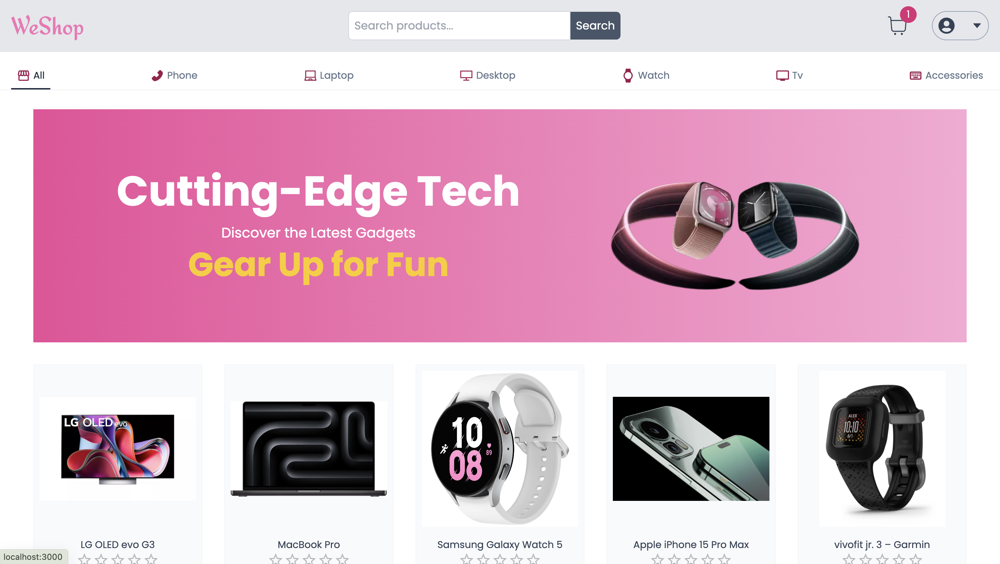

# WeShop E-Commerce Platform(Under Development)


---
Welcome to WeShop, a cutting-edge e-commerce platform designed for digital and technological products such as iPhones, laptops, TVs, and desktop computers. This repository provides a comprehensive foundation for creating your own feature-rich online store with seamless payment processing.

## Features

- **Next.js**: A React framework for building modern web applications.
- **MongoDB**: A NoSQL database for storing product information, user data, and more.
- **Stripe**: A payment processing platform for secure and efficient online transactions.
- **Tailwind CSS**: A utility-first CSS framework for styling the application.
- **Next-Auth**: Authentication library for Next.js applications.
- **Prisma**: Database toolkit for TypeScript and Node.js.

## Installation

1. **Clone the Repository:**
This application is currently in development, and some features may not be fully implemented
   ```bash
   git clone https://github.com/samarkand-fr/WeShop.git
   ```

1.Install Dependencies:
  - cd next-ecommerce
  - npm install

2.Set Up Environment Variables:
   Create a .env.local file in the project root and add the following variables:
   - DATABASE_URL=your-mongodb-uri
   - NEXTAUTH_SECRET=your-nextauth-secret
   - GOOGLE_CLIENT_ID=your-google-client-id
   - GOOGLE_CLIENT_SECRET=your-google-client-secret
   - STRIPE_WEBHOOK_SECRET=your-stripe-webhook-secret

3. Run the Application:
   - npm run dev
   - Open http://localhost:3000 in your browser to view the application.

Usage
- **Product Management:**
 Easily add, update, or remove products from the MongoDB database.
- **User Authentication:**
 Utilize Next-Auth for secure user authentication and authorization.
- **Stripe Integration:**
 Seamless integration with Stripe for processing payments.
- **Responsive Design:**
 Built with a mobile-first approach, ensuring a great user experience on all devices.
- **Tailwind CSS Styling:**
 Leverage the power of Tailwind CSS for efficient and customizable styling.

Happy coding! 🚀# WeShop
